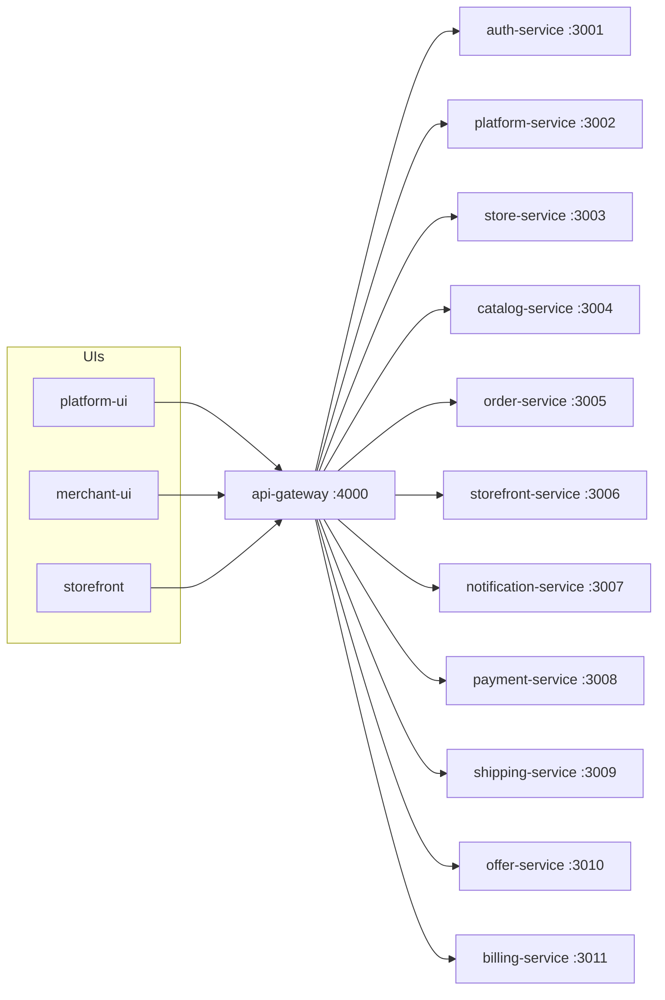

# Knowledge graph — merchant-ui




## This repo

```mermaid
flowchart TD
  APP[app/(admin) pages]
  APP --> API[lib/api.ts]
  API --> GW[api-gateway]
  AUTH[lib/auth-store.ts] --> API
  SIDE[components/layout/Sidebar.tsx] --> APP
```

## Route groups

| Group | Path | Purpose |
| --- | --- | --- |
| `(auth)` | `/login` `/register` `/forgot-password` `/signed-out` | Merchant auth |
| `(setup)` | `/setup` | Onboarding wizard |
| `(admin)` | `/dashboard` `/catalog` `/orders` `/customize/*` `/settings/*` `/store` `/stock` `/reports` `/notifications` `/subscription` `/support` | Authenticated merchant |

## Task → file

- New admin screen: `app/(admin)/<feature>/page.tsx` plus a link in `components/layout/Sidebar.tsx`.
- API call: `lib/api.ts` then the page.
- Auth/token bugs: `lib/api.ts` + `lib/auth-store.ts`.
